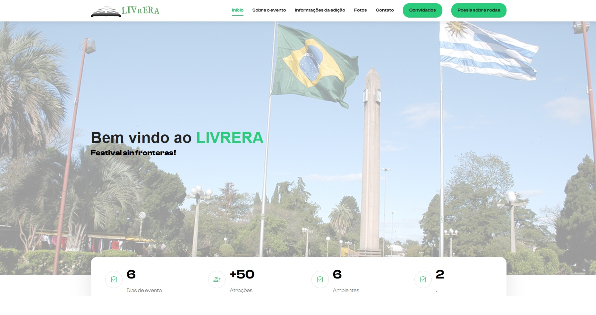

## Sistema Web para Festival Cultural Livrera

### Descrição
Desenvolvimento de um sistema web como parte de um projeto de extensão do IFSul Campus Sant'Ana do Livramento, em parceria com a organização do festival. O sistema foi criado para atender às demandas de gestão e comunicação do festival. A plataforma centralizada 
permitiu que as informações e obras dos artistas convidados do evento, 
assim como as publicações do Poesia Sobre Rodas sejam vistas e 
compartilhadas de forma eficiente, além da exibição de programação em tempo real.

### Objetivo
Facilitar a organização do festival, automatizar processos manuais e melhorar a experiência dos visitantes, permitindo que eles acessassem informações atualizadas de maneira prática.

### Minhas Contribuições
- **Desenvolvimento Backend**: Criação de APIs utilizando **Laravel** para o cadastro e gerenciamento de eventos.
- **Interface Frontend**: Implementação de interfaces responsivas usando **Bootstrap** e **TailwindCSS**.
- **Integração de Banco de Dados**: Design e gestão do banco de dados **MySQL** para armazenar informações do evento.
- **Documentação e Suporte**: Elaboração de manuais para os administradores do sistema e suporte técnico durante o evento.

### Tecnologias Utilizadas
- **Linguagens**: PHP, JavaScript, HTML, CSS.
- **Frameworks**: Laravel (Backend), Bootstrap e TailwindCSS (Frontend).
- **Banco de Dados**: MySQL.
- **Ferramentas de Gestão**: Jira para versionamento e acompanhamento de tarefas.

### Resultado
A ferramenta foi bem avaliada pelos organizadores, que destacaram sua praticidade e eficiência.
